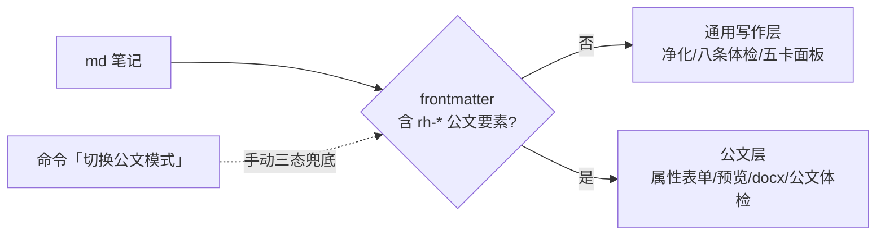

# RedQuill

在 Obsidian 里舒服地写中文 md——通用写作（粘贴净化、排版体检、写作仪表盘）与公文排版（GB/T 9704 红头/版式/docx）合一的插件：frontmatter 命中公文要素自动进公文模式，普通笔记走通用写作体验。

🔗 BRAT 安装：`ygnstudio/redquill`　⬇️ [手动下载](../../releases)　📖 [使用指南](docs/user_guide_2026-09-03_v1_active.md)　🐛 [问题反馈](../../issues)

一个插件、两套能力：正文笔记（净化/体检/仪表盘）与公文笔记（红头/版式/导出）由 frontmatter 自动判定，也可命令手动切换模式。

## 功能特性

**通用写作层（普通 md 笔记）**

- **粘贴即纯净**：命令「粘贴并净化」把剪贴板内容（网页/Word/WPS/公众号编辑器复制）清洗后插入——剥 HTML 标签/脚本/样式、去行首尾空格（含全角/NBSP）、空行压成一段一空行、连续空白折一；「清洗选区」不依赖剪贴板，选中即洗
- **自动净化粘贴**（可选开关）：设置开启后，编辑器内粘贴带格式的 HTML 内容自动清洗插入（纯文本直通不误伤），默认关、用命令为主
- **中文排版体检**（命令「排版体检·通用八条」）：写完一键自查——重复标点/半角混用/中英空格/括号引号配对/直引号/叠字/控制字符/全角空格，八规则分级报告、行号可点击跳源码定位；只查不改不阻塞
- **一键修复**（命令「一键修复排版」）：只自动修无歧义项（重复标点/半角标点/中英空格/控制字符/全角空格），逐行替换保留 Ctrl+Z 撤销；有歧义项（括号引号配对/直引号/叠字）只报不修
- **代码与链接不误伤**：代码围栏、行内 code、URL、md 链接整段跳过；数字不误伤：2026 年、3.5、v1.2.3、「1..5」范围都不算半角混用
- **写作面板五卡**（右侧栏）：字数（中文/非空白/总字符/段数/光标行）、标点体检速览（实时 error/warn 计数 + 看报告）、标题树（h1-h3 点击跳转、当前小节高亮）、快捷插入（表格/引用/代码块/折叠块/待办/分隔线/图片占位）、空文档引导

**公文排版层（frontmatter 含 `rh-*` 要素时自动浮现）**

- **GB/T 9704-2012 公文预设**：标题二号小标宋、正文三号仿宋、28 磅固定行距、页边距 37/35/28/26mm、页码「— 1 —」单页右双页左；另内置「日常·简洁」预设，全部参数可在设置页修改
- **红头（版头）**：frontmatter 驱动——发文机关标志（红色小标宋）、发文字号、签发人（上行文左右对排）、份号/密级/紧急程度、红色分隔线；`rh-agency` 用 `/` 分隔多机关即联合行文（字号自适应缩号）
- **中文属性表单**：写作辅助面板内「公文属性表单」按钮弹出中文标签表单（版头/主体/版记三组），以 `rh-*` 英文键写入 frontmatter，不用记键名；兼容旧版 `redhead:` 嵌套写法
- **公文排版体检**：对当前笔记做国标自查——错误/建议分级报告、行号可点击跳源码；只查不改不阻塞导出
- **排版预览即真相**：预览面板与 docx 由同一份格式规范渲染——所见即所得；打印/存为 PDF 走预览同一管线
- **导出 docx**：中英文自动分流（中文宋仿黑楷、西文 Times New Roman），奇偶页页脚页码域，Word/WPS 直接可用；正文后 `---` 分隔附件区自动另面排版；`rh-seal` 印章浮图压盖落款
- **新建公文向导**（16 文种）：命令「新建公文」弹文种列表（打字筛选）→ 输标题 → 自动预填默认发文机关与当年文号；模板可批量安装到模板文件夹（装 Templater 附带弹窗版）
- **写作辅助面板**（公文侧栏）：跟随光标诊断当前行公文角色（文件标题/一二级/正文/表格…）、给下一级序号建议（「一级 三、」「二级 （四）」）、一键插入标题/表格/附件分隔线
- **移动端可用**：通用写作层 `isDesktopOnly: false` 双端生效；桌面能力（预览/docx）在移动端自动降级不干扰
- **纯函数内核可机器校验**：净化/体检/公文解析/版式全部无 Obsidian 依赖，15 套校验（400+ 断言）跑在 CI——规则改动可回归

## 目录结构

```
redquill/
├── src/
│   ├── main.ts            # 插件壳（三视图/12 命令/上下文判定接线/设置页双区）
│   ├── context.ts         # 公文上下文判定器（frontmatter 命中 rh-* → 公文模式，可手动三态）
│   ├── paste_clean.ts     # 粘贴净化纯函数（合一唯一引擎，公文/通用共用）
│   ├── checker.ts         # 通用八条体检引擎 + fixAll 一键修复（纯函数）
│   ├── mdast.ts           # 标题树 outlineOf / 字数统计 charStats（纯函数）
│   ├── settings_util.ts   # 通用设置模型与清洗管线
│   ├── file_scan.ts       # 批量输入展开（CLI 用，不随插件打包）
│   ├── ledger.ts          # 文号台账判定（CLI 用）
│   ├── cli.ts             # CLI 调试壳（node dist/cli.js …）
│   └── gongwen/           # 公文层（红头/版式/模板/公文体检/预览/docx，防撞名独立子目录）
│       ├── mdast.ts       #   md → 公文结构映射 + frontmatter 解析 + 附件切分 + 裸序号识别
│       ├── format.ts      #   格式规范单一来源（预设/国标常量/fitAgencySizePt）
│       ├── templates.ts   #   16 文种骨架常量 + 新建向导纯函数
│       ├── writeassist.ts #   写作辅助行角色诊断纯函数
│       ├── checker.ts     #   公文排版体检纯函数引擎
│       ├── settings.ts    #   公文设置结构与清洗管线（RedHeadSettings）
│       ├── preview.ts     #   预览 HTML 渲染（与 docx 同源）
│       └── docx_export.ts #   docx 生成（含文件属性：标题/作者/文号）
├── tests/               # 校验脚本与样例（15 套：红公文线 13 + 通用 v010 + 判定器 merge）
├── docs/                # 使用指南与设计文档
├── main.js              # 构建产物（BRAT 直接拉取）
├── manifest.json
└── styles.css
```

## 工作流



## 使用

> 完整说明见 **[使用指南](docs/user_guide_2026-09-03_v1_active.md)**（通用八条规则明细、粘贴净化与剪贴板权限、写作面板五卡、公文 `rh-*` 属性表、版式/印章/联合行文、CLI、FAQ）。快速上手：

1. **安装**：BRAT 添加 `ygnstudio/redquill`（或从 Release 下载 `main.js`/`manifest.json`/`styles.css` 放入 `.obsidian/plugins/redquill/`）
2. **普通写作**：正常打字；网页/Word 复制内容过来时运行「**粘贴并净化**」；写完运行「**排版体检·通用八条**」看报告点行号跳转；长文开侧栏「**写作面板**」
3. **写公文**：命令「**新建公文**」选文种开写（frontmatter 自动带公文要素 → 插件自动切公文模式）；或开「**写作辅助面板**」点「公文属性表单」补要素；预览面板「**导出 docx**」出 Word/WPS 文件
4. **两套都不想要自动切**：命令「**切换公文模式**」三态循环（自动判定 → 强制公文 → 强制通用），会话级即时生效

命令一览（12 个）：`打开排版预览` / `打开写作辅助面板`（内含公文属性表单/公文体检/导出按钮）/ `打开通用写作面板` / `新建公文` / `粘贴并净化` / `清洗选区 / 当前段` / `公文排版体检` / `排版体检·通用八条` / `一键修复排版` / `导出 docx` / `切换公文模式` / `安装公文模板`。

## 开发

```bash
npm install
npm run build                  # tsc 类型检查 + esbuild 打包 main.js
npm run build:cli              # CLI 调试壳（node dist/cli.js input.md [--check]）
python3 tests/verify_merge.py  # 判定器校验（36 断言）
# 全量 15 套回归：tests/verify_*.py（红公文线 13 + 通用 v010 + 判定器 merge），CI 逐套跑
```

> 校验脚本需 Python ≥ 3.10（可用 WorkBuddy 受管 3.13 或 brew python3.13）。

**发布（v1.0.0 起自动化）**：打 tag 推送即触发 Actions `release` 工作流——全量 15 套回归 → 构建 → 打包（`main.js`/`manifest.json`/`styles.css` 裸三件 + `redquill-<版本>.zip`）→ 创建 GitHub Release。tag 名须等于 `manifest.json` 的 `version`（带 `v` 前缀），不一致自动失败：

```bash
git tag v1.0.0 && git push origin v1.0.0   # 触发 .github/workflows/release.yml
```

## 联系

- 问题反馈：[GitHub Issues](../../issues)（优先）
- 邮箱：markwalsh6809@gmail.com
- GitHub 主页：https://github.com/ygnstudio
- 小红书：https://www.xiaohongshu.com/user/profile/66a7e7ae000000001d023641

## License

[MIT](LICENSE) © 雁归南（ygnstudio）
